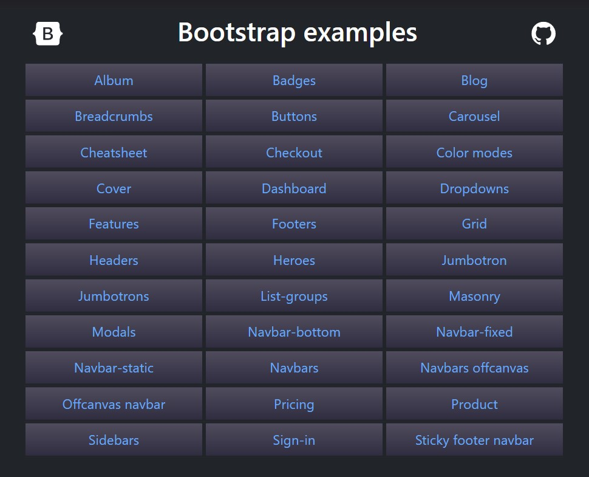

# Bootstrap's Examples PHP version



PHP version for exploring [Bootstrap's examples](https://github.com/twbs/bootstrap/tree/main/site/content/docs/5.3/examples).

RTL examples are not included.
The new 'Color modes' feature is included.

If there is no explicit 'home' link or logo in the example, a home icon is added to return to the main page.

Bootstrap Sass source code included for further customization.

### 1. Install

```bash
git clone git@github.com:eleanorcode/Bootstrap-Examples-PHP-version.git

cd Bootstrap-Examples-PHP-version
```

### 2. Start the built-in PHP web server (PHP >= 5.4)

```bash
php -S localhost:8000
```

Navigate to http://127.0.0.1:8000/

Press Ctrl-C to quit

[PHP built-in web server](https://www.php.net/manual/en/features.commandline.webserver.php)

### 3. To make some changes in .scss files and apply them:

```bash
npm install
npm run build
```
